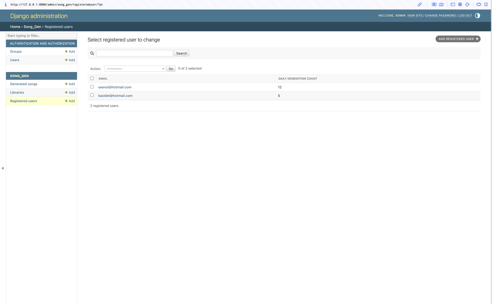
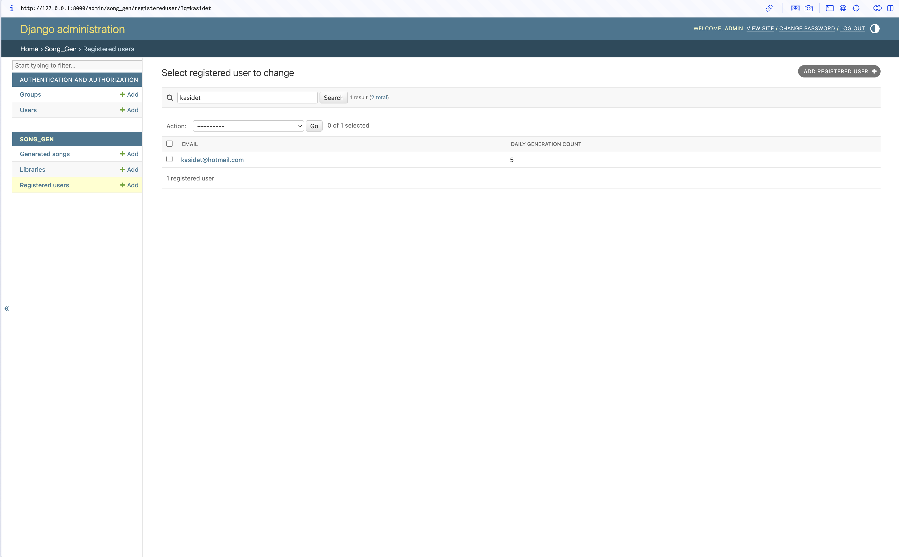
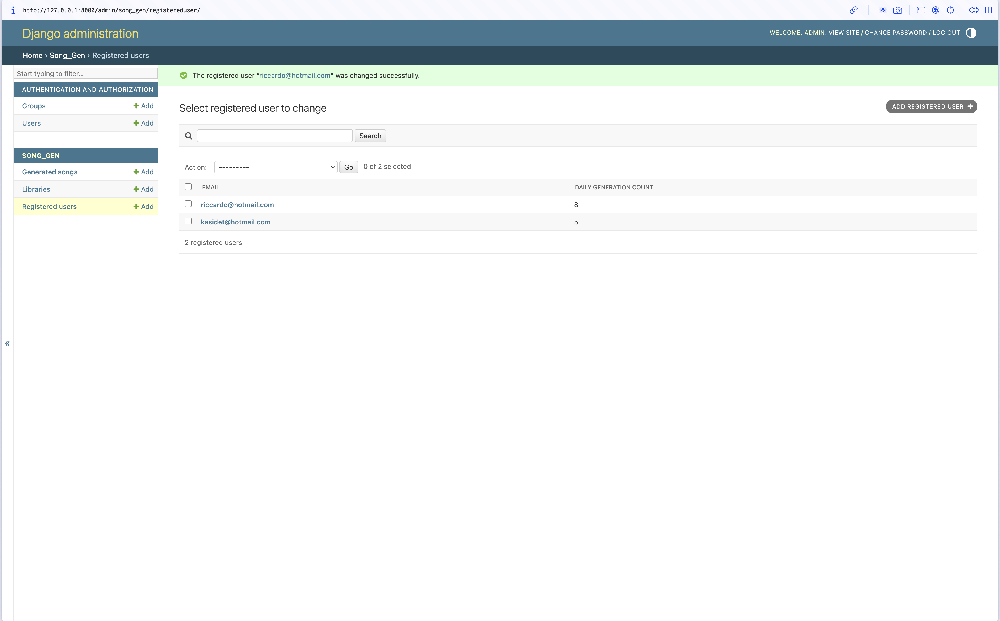
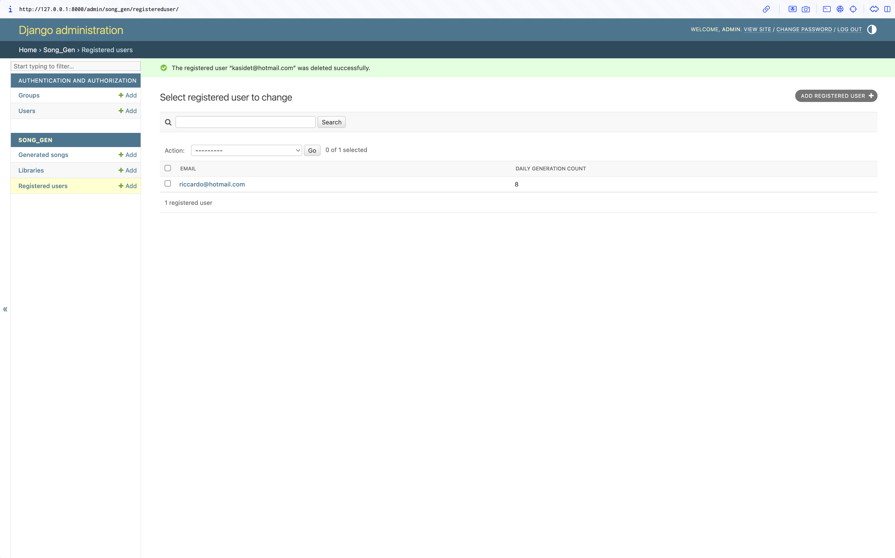

# Chitara

## Prerequisites
- Python 3.8+
- pip (Python package installer)

## Installation Guide

1. **Clone the repository** (if you haven't already downloaded the project folder)
   ```bash
   git clone https://github.com/Nunthapop123/Chitara.git
   cd Chitara
   ```

2. **Create and activate a virtual environment**
   ```bash
   python -m venv venv
   
   # On macOS/Linux:
   source venv/bin/activate
   
   # On Windows:
   venv\Scripts\activate
   ```

3. **Install dependencies**
   Ensure your virtual environment is activated, then install the required packages:
   ```bash
   pip install -r requirements.txt
   ```

4. **Initialize the Database**
   Generate and apply the migrations to set up the database schema:
   ```bash
   python manage.py makemigrations
   python manage.py migrate
   ```

## Running the Application & Demonstrating CRUD Operations

1. **Create an Admin Superuser**
   To interact with the database and demonstrate CRUD operations, you need an admin account:
   ```bash
   python manage.py createsuperuser
   ```
   Follow the prompts to set a username, email, and password.

2. **Run the Development Server**
   ```bash
   python manage.py runserver
   ```

3. **Log in to Django Admin**
   Open your browser and navigate to `http://127.0.0.1:8000/admin/`. Log in with the superuser credentials you just created.

From here, you can **Create, Read, Update, and Delete** any instance of the core domain entities:
- `Registered Users`
- `Libraries`
- `Generated Songs`

## CRUD Operations Demonstration

The Django Admin interface automatically provides full CRUD (Create, Read, Update, Delete) support for all domain models. Below is the demonstration of these operations in action:

### 1. Create (Add)
*Adding a new record to the database:*

(Create a new user "kasidet@hotmail.com" and "seenoi@hotmail.com")

### 2. Read (View)
*Viewing the list of existing records with search and filter capabilities:*

(Search for "kasidet" to find specific user)

### 3. Update (Modify)
*Modifying existing records (e.g., successfully updating Riccardo's generation count):*

(Update the email of the user "seenoi@hotmail.com" to "riccardo@hotmail.com" and the generation count from 12 to 8)

### 4. Delete (Remove)
*Selecting and removing records from the database:*

(Delete the user "kasidet@hotmail.com" from the database)

## Song Generation Engine Configuration

The application uses the **Strategy Pattern** to support interchangeable song generation implementations:
- **Mock Strategy**: Offline, instant, deterministic results (ideal for development/testing)
- **Suno API Strategy**: Real integration with api.sunoapi.org (requires API key)

### Environment Variable Setup

1. **Copy the example file:**
   ```bash
   cp .env.example .env
   ```

2. **Edit `.env`** in the project root (same directory as `manage.py`):
   ```env
   # Use 'mock' for mock offline/test generation
   # Use 'suno' for real API (requires API key below)
   # GENERATOR_STRATEGY=suno
   
   # Only needed if GENERATOR_STRATEGY=suno
   # Get your key from: https://api.sunoapi.org/
   SUNO_API_KEY=
   ```

3. **Install required packages:**
   ```bash
   pip install python-dotenv requests
   ```

