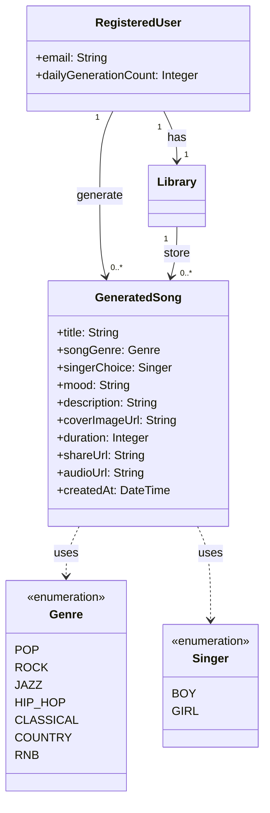
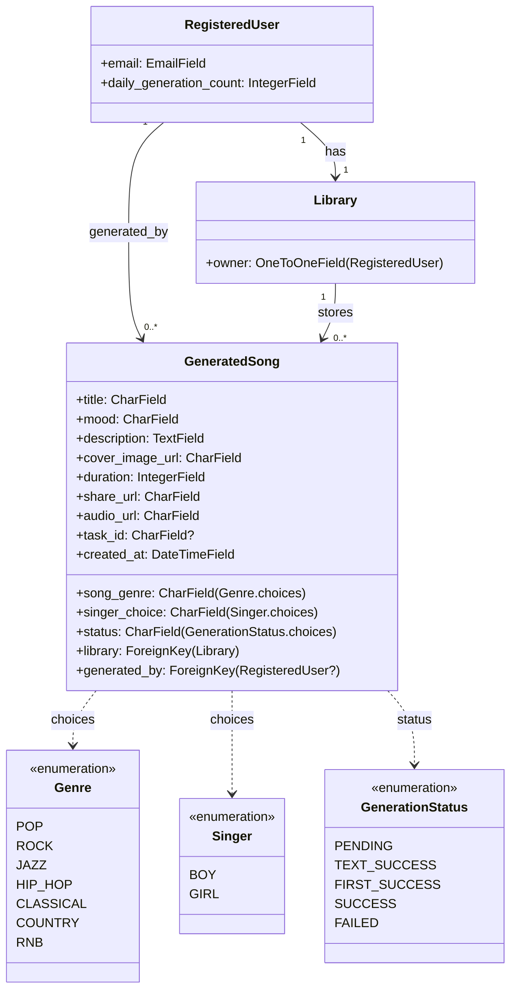
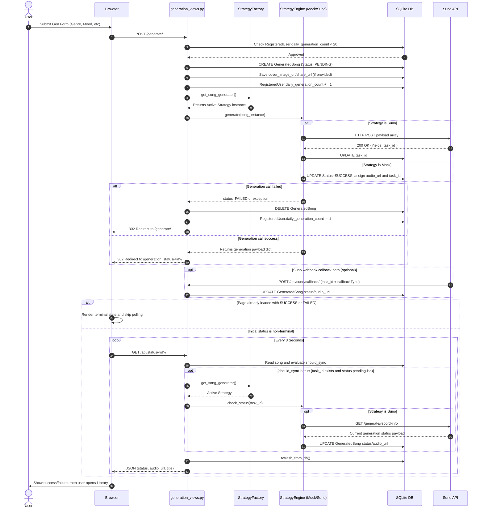

# Chitara - AI Music Generation Platform

## Description
Chitara is a web-based AI music generation application built with Django. It allows authenticated users to create custom music tracks by defining parameters such as genre, singer type, mood, and a descriptive story. Users have their own personal library to manage, playback, download, and share their generated songs. 

The core music generation engine implements the **Strategy Design Pattern**, allowing the system to seamlessly switch between a local Mock generator (for development) and the live Suno API.

---

## Architecture Documentation 

Chitara's architecture is meticulously documented across three core viewpoints: Domain modeling, MVT (Model-View-Template) logic, and the asynchronous Generation Sequence.

### 1. Domain Model Evolution
To satisfy the requirement: *"Does the student have a up-to-date domain model?"*, we provide a comparison between our initial architecture and the final code-synchronized implementation.

#### A. Old Proposal (Exercise #2)
*Reconstructed from the domain model submitted in Exercise #2.*



#### B. New Domain Model (Code-Synced)
*This is the live, up-to-date model reflecting the current implementation in `song_gen/models`.*



#### C. Key Differences and Rationale
The transition from the old proposal to the final implementation was driven by synchronization requirements:

1. **Naming Standard:** Migrated from camelCase (old) to snake_case (new) to match Python/Django conventions and actual database field names.
2. **Added Control Fields:** Introduced `task_id` and `status` to `GeneratedSong` to support the asynchronous Suno API generation workflow.
3. **Explicit State Management:** Added the `GenerationStatus` enumeration to track multi-stage synthesis (Pending -> Text -> Audio -> Success).
4. **Type-Fidelity:** Updated generic types (String/Integer) to specific Django field types (`EmailField`, `ForeignKey`, etc.) for more technical accuracy.
5. **Ownership Provenance:** Added the `generated_by` link to ensure clear auditability of song creation.

### 2. Application Class Diagram (Detailed, Code-Synced)
The primary architectural map showing View modules, Template hierarchies, and the Strategy pattern injection.

```mermaid
classDiagram
    namespace LifecycleAndRouting {
        class SongGenConfig {
            <<AppConfig>>
            +default_auto_field
            +name
            +ready()
        }

        class UserSignedUpSignal {
            <<signal handler>>
            +user_signed_up_callback(request, user, **kwargs)
        }

        class DjangoUser {
            <<django.contrib.auth.models.User>>
            +username
            +email
        }

        class URLConf {
            <<module: chitara/urls.py>>
            +urlpatterns
        }
    }

    namespace Models {
        class RegisteredUser {
            +email: EmailField
            +daily_generation_count: IntegerField
            +__str__()
        }

        class Library {
            +owner: OneToOneField(RegisteredUser)
            +__str__()
        }

        class GeneratedSong {
            +title: CharField
            +song_genre: CharField(Genre.choices)
            +singer_choice: CharField(Singer.choices)
            +mood: CharField
            +description: TextField
            +cover_image_url: CharField
            +duration: IntegerField
            +share_url: CharField
            +audio_url: CharField
            +task_id: CharField?
            +status: CharField(GenerationStatus.choices)
            +created_at: DateTimeField
            +library: ForeignKey(Library)
            +generated_by: ForeignKey(RegisteredUser?)
            +__str__()
        }

        class Genre {
            <<TextChoices>>
            +POP
            +ROCK
            +JAZZ
            +HIP_HOP
            +CLASSICAL
            +COUNTRY
            +RNB
        }

        class Singer {
            <<TextChoices>>
            +BOY
            +GIRL
        }

        class GenerationStatus {
            <<GeneratedSong.GenerationStatus>>
            +PENDING
            +TEXT_SUCCESS
            +FIRST_SUCCESS
            +SUCCESS
            +FAILED
        }
    }

    namespace Strategies {
        class SongGeneratorStrategy {
            <<abstract interface>>
            +generate(song)
            +check_status(task_id)
        }

        class MockSongGeneratorStrategy {
            +generate(song)
            +check_status(task_id)
        }

        class SunoSongGeneratorStrategy {
            +BASE_URL
            +ALLOWED_MODELS
            +generate(song)
            +check_status(task_id)
        }

        class StrategyFactory {
            <<module>>
            +get_song_generator()
        }
    }

    namespace ViewModules {
        class AuthViews {
            <<module: auth_views.py>>
            +landing_view(request)
            +login_view(request)
            +register_view(request)
            +logout_view(request)
            +get_or_create_user(request)
        }

        class GenerationViews {
            <<module: generation_views.py>>
            +build_share_url(request, song_id)
            +store_cover_image(request, cover_file)
            +generate_view(request)
            +generation_status_view(request, id)
            +song_status_api(request, id)
        }

        class LibraryViews {
            <<module: library_views.py>>
            +library_view(request)
            +shared_song_view(request, id)
            +delete_song_view(request, id)
            +library_search_api(request)
        }

        class SunoCallbackView {
            <<module: suno_callback_view.py>>
            +suno_callback(request)
        }
    }

    namespace Templates {
        class BaseTemplate { <<base.html>> }
        class LandingTemplate { <<landing.html>> }
        class LoginTemplate { <<login.html>> }
        class RegisterTemplate { <<register.html>> }
        class GenerateTemplate { <<generate.html>> }
        class GenerationStatusTemplate { <<generation_status.html>> }
        class LibraryTemplate { <<library.html>> }
        class SharedSongTemplate { <<shared_song.html>> }
        class SummaryModalTemplate { <<summary_modal.html>> }
    }

    namespace AdminLayer {
        class RegisteredUserAdmin {
            <<ModelAdmin>>
            +list_display
            +search_fields
        }

        class LibraryAdmin {
            <<ModelAdmin>>
            +list_display
            +search_fields
            +inlines
        }

        class GeneratedSongInline {
            <<TabularInline>>
            +model
            +readonly_fields
            +can_delete
        }

        class GeneratedSongAdmin {
            <<ModelAdmin>>
            +list_display
            +list_filter
            +search_fields
            +readonly_fields
        }
    }

    SongGenConfig ..> UserSignedUpSignal : imports module on ready()
    UserSignedUpSignal ..> DjangoUser : listens user_signed_up
    UserSignedUpSignal ..> RegisteredUser : get_or_create by email
    UserSignedUpSignal ..> Library : get_or_create owner

    URLConf ..> AuthViews : routes landing/login/register/logout
    URLConf ..> GenerationViews : routes generate/status APIs
    URLConf ..> LibraryViews : routes library/shared/delete/search
    URLConf ..> SunoCallbackView : routes /api/suno/callback/

    RegisteredUser "1" --> "1" Library : owner
    Library "1" --> "0..*" GeneratedSong : songs
    RegisteredUser "1" --> "0..*" GeneratedSong : generated_songs
    GeneratedSong ..> Genre : choices
    GeneratedSong ..> Singer : choices
    GeneratedSong ..> GenerationStatus : status choices

    MockSongGeneratorStrategy ..|> SongGeneratorStrategy : implements
    SunoSongGeneratorStrategy ..|> SongGeneratorStrategy : implements
    StrategyFactory ..> SongGeneratorStrategy : returns implementation
    MockSongGeneratorStrategy ..> GeneratedSong : updates status/audio/task
    SunoSongGeneratorStrategy ..> GeneratedSong : updates status/audio/task

    AuthViews ..> DjangoUser : authenticate/login/logout
    AuthViews ..> RegisteredUser : get_or_create
    AuthViews ..> Library : get_or_create

    GenerationViews ..> AuthViews : uses get_or_create_user
    GenerationViews ..> Library : get_or_create
    GenerationViews ..> GeneratedSong : create/query/update
    GenerationViews ..> StrategyFactory : generation/status sync

    LibraryViews ..> AuthViews : uses get_or_create_user
    LibraryViews ..> GeneratedSong : query/delete
    LibraryViews ..> StrategyFactory : background status sync

    SunoCallbackView ..> GeneratedSong : callback status/audio update

    LandingTemplate --|> BaseTemplate : extends
    LoginTemplate --|> BaseTemplate : extends
    RegisterTemplate --|> BaseTemplate : extends
    GenerateTemplate --|> BaseTemplate : extends
    GenerationStatusTemplate --|> BaseTemplate : extends
    LibraryTemplate --|> BaseTemplate : extends
    SharedSongTemplate --|> BaseTemplate : extends
    GenerateTemplate ..> SummaryModalTemplate : includes

    AuthViews ..> LandingTemplate : render
    AuthViews ..> LoginTemplate : render
    AuthViews ..> RegisterTemplate : render
    GenerationViews ..> GenerateTemplate : render
    GenerationViews ..> GenerationStatusTemplate : render
    LibraryViews ..> LibraryTemplate : render
    LibraryViews ..> SharedSongTemplate : render

    RegisteredUserAdmin ..> RegisteredUser : registers
    LibraryAdmin ..> Library : registers
    LibraryAdmin ..> GeneratedSongInline : inlines
    GeneratedSongInline ..> GeneratedSong : inline model
    GeneratedSongAdmin ..> GeneratedSong : registers
```



### 3. Song Generation Sequence Flow
Detailed chart of the asynchronous interaction pattern bridging the User, the Strategy Factory, and the Suno API.



---

## Features by Role

> **Note:** Guest user access is not supported. All users must be logged in to perform any function within the application.

### Registered User (Creator / Listener)
* **Authentication:** Secure login via Google OAuth.
* **AI Music Generation:** Form-based generation specifying Genre, Singer (Boy/Girl), Mood, and Description.
* **Daily Limits:** Users are restricted to generating 20 songs per day or until they run out of credits.
* **Personal Library:** Unlimited storage for generated songs, sorted by the most recent creations.
* **Playback & Management:** Native web audio playback, search functionality, and the ability to delete unwanted tracks.
* **Export & Share:** Download generated tracks as MP3 files or share unique links with others.

### Client (Teaching Assistants / Evaluators)
* Ability to evaluate the strategy pattern implementation, generation logic, and overall domain model structure.

### Admin / Superuser
* **Django Admin Interface:** Full CRUD access to manage `Registered Users`, `Libraries`, and `Generated Songs`.

---

## Prerequisites
* Python 3.8+
* `pip` (Python package installer)
* Git

---

## Setup & Installation Guide

### 1. Clone the repository
```bash
git clone https://github.com/Nunthapop123/Chitara.git
cd Chitara
```

### 2. Create and activate a virtual environment
```bash
python -m venv venv

# On macOS/Linux:
source venv/bin/activate

# On Windows:
venv\Scripts\activate
```

### 3. Install dependencies
Ensure your virtual environment is activated, then install the required packages:
```bash
pip install -r requirements.txt
```

### 4. Environment Configuration (.env)
Copy the example environment file to create your own local `.env` file:

**On macOS/Linux:**
```bash
cp .env.example .env
```

**On Windows (Command Prompt):**
```cmd
copy .env.example .env
```

Open the newly created `.env` file and configure your specific variables:

* **Music Engine Strategy (`GENERATOR_STRATEGY`):** You can toggle the backend engine between local testing and live generation:
  * Set it to `mock` to bypass the external API and generate an instant mock track (perfect for UI/UX testing without consuming credits).
  * Set it to `suno` to connect to the live AI model. **If you use this strategy, you MUST also provide a valid API token in the `SUNO_API_KEY` variable.**

* **OAuth Setup (Google Login):** To enable Google Sign-In, follow these steps:
  1. Go to the [Google Cloud Console](https://console.cloud.google.com/) and create a new project.
  2. Navigate to "APIs & Services" > "Credentials".
  3. Click "Create Credentials" > "OAuth client ID".
  4. Select "Web application" as the Application type.
  5. Under "Authorized redirect URIs", add: `http://127.0.0.1:8000/accounts/google/login/callback/`
  6. Click "Create".
  7. Copy your newly generated Client ID and Client Secret into the `GOOGLE_CLIENT_ID` and `GOOGLE_CLIENT_SECRET` variables in your `.env` file.

### 5. Initialize the Database
Apply the pre-packaged library migrations and set up the database schema:
```bash
python manage.py migrate
```

### 6. Create an Admin Superuser
To interact with the database and demonstrate CRUD operations, you need an admin account:
```bash
python manage.py createsuperuser
```
Follow the prompts to set a username, email, and password.

---

## How to Run

### Run the Development Server
Start the Django development server:
```bash
python manage.py runserver
```

### Access the Application
* **Frontend UI:** Open your browser and navigate to `http://127.0.0.1:8000/`. You can log in securely using your configured Google OAuth flow.
* **Admin Dashboard:** Navigate to `http://127.0.0.1:8000/admin/` and log in with your superuser credentials to successfully view, create, update, or delete users and generated songs.
